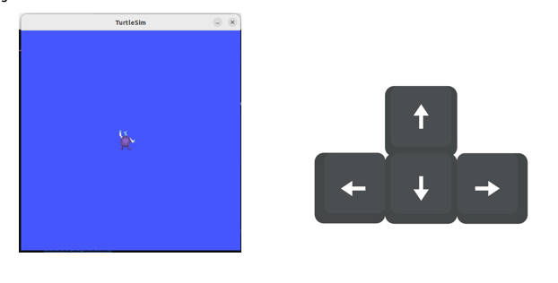
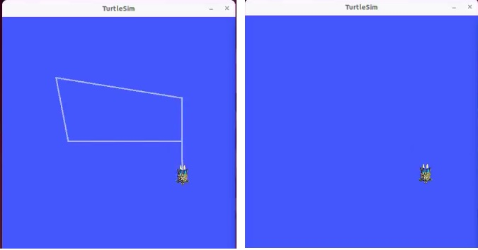
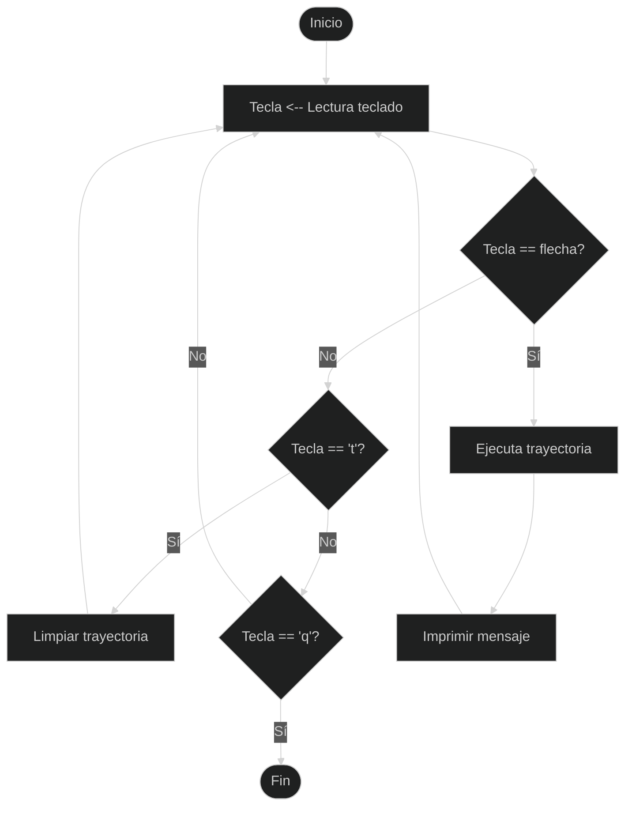
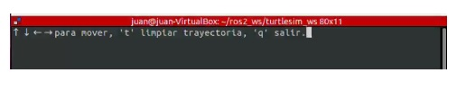
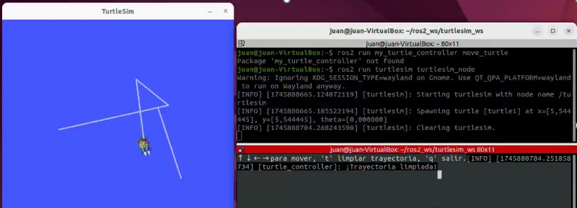

# Laboratorio No. 01 Robótica de Desarrollo Intro a ROS 2 Humble Turtlesim

## Integrantes
**Juan Manuel Rojas Luna**
**jmrojasl@unal.edu.co**

**Santiago Mariño Cortés**
**smarinoc@unal.edu.co**

## Introducción

A través de este laboratorio, se busca consolidar conocimientos clave sobre el sistema de comunicación de ROS 2, enfocándose en la manipulación de mensajes y la programación de control básico de robots móviles. Además, se desarrollarán habilidades de programación en Python, específicamente orientadas a la manipulación de mensajes ROS y la interacción con el entorno simulado. Para ello, se buscará controlar el movimiento de una tortuga virtual, respondiendo a comando enviados por teclado de velocidad en tiempo real.  Adcionalmente, se implementara un proceso para dibujar trayectorias defininas mediante secuencias programadas de movimientos. Esto permitirá al usuario definir y ejecutar patrones de desplazamiento predefinidos, proporcionando una visión más clara de cómo los comandos de control afectan el comportamiento del robot.

## Planteamiento del problema

Dentro del **workspace** creado en clase (*my_turtle_controller*), se debe editar el archivo **move turtle.py**, el objetivo es controlar el movimiento de la tortuga en el simulador *turtlesim* mediante el teclado, cumpliendo con los siguientes requerimientos:

## Objetivos

1. Permitir el movimiento lineal y angular de la tortuga mediante la creación de un nodo que, al recibir como entrada las flechas del teclado, controle su desplazamiento de la siguiente manera: <br>

  Acciones asignadas:<br>
◦ Flecha ↑: avanzar hacia adelante.<br>
◦ Flecha ↓: retroceder.<br>
◦ Flecha ←: girar a la izquierda.<br>
◦ Flecha →: girar a la derecha.<br>


## Restricción importante:
• Gestionar el movimiento de la tortuga exclusivamente desde el script *move_turtle.py*.

• No se puede utilizar el nodo *turtle_teleop_key* para el control con teclado.

## Diseño y funcionamiento

**1. Control de movimiento manual**

El controlador de movimiento manual de la tortuga en Turtlesim está diseñado para utilizar el teclado, específicamente las flechas direccionales. Existen varias formas de configurar este control. Una de ellas consiste en que, al oprimir una flecha, la tortuga se mueva de manera continua en la dirección indicada hasta que se presione una flecha diferente para cambiar su trayectoria.



Sin embargo, este diseño presenta una limitación importante: como el movimiento de la tortuga está restringido por el área de la pantalla de Turtlesim, si no se modifica la dirección oportunamente, la tortuga inevitablemente chocará contra una de las paredes, ya que continuará avanzando indefinidamente en la trayectoria inicial.

Una forma de mejorar este diseño es implementar un movimiento discreto, es decir, que al presionar una flecha la tortuga se desplace una distancia mínima en trayectoria lineal o realice una rotación angular limitada. Este enfoque permite movimientos más controlados y evita que la tortuga choque si no se cambia su dirección de inmediato.

Para que esta mejora sea efectiva, es indispensable que el desplazamiento por pulsación sea pequeño, lo que permitirá tener una mejor resolución y precisión en el movimiento de la tortuga sobre la pantalla.

Durante la ejecución de Turtlesim, un inconveniente común es que, a medida que la tortuga se desplaza, se va imprimiendo su trayectoria sobre la pantalla. Cuando se generan desplazamientos prolongados, esto puede provocar que las trayectorias se superpongan, dificultando la visualización clara del movimiento actual. Para mantener una pantalla limpia y mejorar la experiencia de control, se implementó la tecla 't', que permite borrar las trayectorias anteriores sin necesidad de reiniciar el programa. Además, se decidió modificar el comando de salida, reemplazando la combinación tradicional Ctrl + C por la tecla 'q' para facilitar un cierre más rápido y sencillo. En este diseño, las teclas 't' y 'q' cumplen funciones específicas que aumentan la flexibilidad y el control del sistema: la primera permite limpiar la trayectoria registrada, facilitando nuevos intentos o correcciones, y la segunda proporciona una forma segura y controlada de finalizar la ejecución del programa.



Ahora se describe el funcionamiento de nuestro diseño: El controlador de movimiento manual inicia leyendo continuamente la entrada del teclado dentro de un bucle principal. Cada vez que se presiona una tecla, primero se verifica si corresponde a una flecha; si es así, se ejecuta una trayectoria y se imprime un mensaje antes de volver a leer el teclado. Si la tecla no es una flecha, se evalúa si es la letra 't'; en ese caso, el programa limpia la trayectoria y continúa esperando una nueva entrada. Si tampoco es 't', se verifica si la tecla es 'q'; si lo es, el programa finaliza su ejecución. Si la tecla presionada no corresponde a ninguna de las opciones anteriores, simplemente se ignora y se vuelve a leer una nueva tecla. 

A continuación, se presenta el diagrama de flujo que describe el funcionamiento del controlador de movimiento manual:


## Procedimiento

 **1. Control de movimiento manual**
 
 
Dentro del **workspace** creado en clase (my_turtle_controller), se procedió a editar el archivo move_turtle.py para poder mover la tortuga utilizando las flechas del teclado. A continución se describe cada linea de código para la conformaciòn del control de movimiento manual.

**Adición de librerias**

Como primer paso, se agregaron nuevas librerías además de las que ya existían en el código anterior. Las librerías incorporadas fueron:

◦ Empty: Esta librería es un tipo especial de servicio definido en el paquete std_srvs, que se usa cuando se quiere activar una acción en un nodo sin tener que enviarle parámetros. Un ejemplo común de su uso es la limpieza de la pantalla en una simulación.

◦ curses: Esta librería proporciona un conjunto de funciones para la gestión de entradas de teclado permitiendo capturar pulsaciones de teclas sin necesidad de presionar "Enter" y gestionar eventos de teclado en tiempo real.

La libreria Empty fue utilizada para implementar una función adicional que permita limpiar los trazos de las trayectorias marcadas en la pantalla de turtlesim.
 
 ```
import rclpy
from rclpy.node import Node
from geometry_msgs.msg import Twist
from std_srvs.srv import Empty           
import curses                            
 
```
**Creación de la clase TurtleController**

Se definió la clase **TurtleController**, la cual heredó de la clase **Node**, lo que permite que TurtleController se convierta en un nodo dentro de ROS.

*def __init__(self)*: inicializa el objeto de la clase **TurtleController** mediante el método especial, el cual actúa como el constructor de la clase.

*super().__init__('turtle_controller')*: dentro del constructor, se invoca el constructor de la clase base **Node**  con *super().*. En este caso, 'turtle_controller' fue el nombre asignado al nodo dentro de ROS.

*self.create_publisher(Twist, '/turtle1/cmd_vel', 10)*: crea un publicador en la clase **TurtleController** utilizando el método. Este publicador permite que el nodo envie mensajes del tipo Twist al tópico */turtle1/cmd_vel*, el cual se utiliza para controlar el movimiento de la tortuga en el simulador. 

```
class TurtleController(Node):       
    def __init__(self):
        super().__init__('turtle_controller')
        self.publisher_ = self.create_publisher(Twist, '/turtle1/cmd_vel', 10)
```

**Creación de cliente para limpiar la trayectoria**

Para limpiar la pantalla de las trayectorias marcadas por la tortuga, se creó un cliente para interactuar con un servicio clear en ROS de la siguiente manera:

*self.clear_client = self.create_client(Empty, '/clear')*: Esta línea crea un cliente para el servicio /clear. En ROS, un cliente de servicio es un nodo que envía solicitudes a un servicio y recibe respuestas. El tipo de mensaje utilizado fue Empty, lo que significa que no se requiere enviar ni recibir datos.

*while not self.clear_client.wait_for_service(timeout_sec=1.0)*: Se define un ciclo para que el cliente espere hasta que el servicio /clear este disponible. El parámetro *timeout_sec=1.0* hace que el cliente espere 1 segundo entre cada intento de conexión. Si el servicio no esta disponible en ese tiempo, el cliente continua esperando y repite la comprobación en cada iteración del bucle.

*self.get_logger().info('Esperando al servicio /clear...')*: Mientras espera la disponibilidad del servicio, el nodo imprime un mensaje en el registro indicando que siga esperando. Este mensaje es útil para informar que el cliente continua buscando el servicio para poder interactuar con él.

```
self.clear_client = self.create_client(Empty, '/clear')
while not self.clear_client.wait_for_service(timeout_sec=1.0):
    self.get_logger().info('Esperando al servicio /clear...')
```

**Creación de la función Limpiar trayectoria (clear_trail)**

Se creó la función Limpiar trayectoria con los siguientes comandos:

*def clear_trail(self)*: Define la función clear_trail que limpia la trayectoria de la tortuga.

*req = Empty.Request()*: Crea una solicitud vacía para enviar al servicio /clear. 

*self.clear_client.call_async(req)*: Este código está llamando de forma asíncrona a un servicio usando *clear_client* y pasando un mensaje de solicitud (req) al servicio. Dado que es una llamada asíncrona, el programa no se detendrá a esperar una respuesta, sino que continuará su ejecución mientras se procesa la solicitud en segundo plano.

*self.get_logger().info(...)*: Registra un mensaje indicando que la trayectoria ha sido limpiada.


```
def clear_trail(self):
        req = Empty.Request()
        self.clear_client.call_async(req)
        self.get_logger().info('¡Trayectoria limpiada!')
```
**Creación de la función control_loop**

Para la función control_loop se efectuaron las siguentes lìneas de còdigo:

*def control_loop(self, stdscr)*: Define la función control_loop, que es un bucle de control para manejar las entradas del teclado para controlar la tortuga. El parámetro *stdscr* maneja la pantalla de la terminal.

*curses.cbreak()*: Activa el modo cbreak en la terminal permitiendo que las teclas que se presionan sean enviadas inmediatamente a la aplicación sin necesidad de presionar Enter.

*stdscr.nodelay(True)*: Configura la ventana de curses para que el modo no bloqueante esté habilitado, es decir, permitir que el programa siga ejecutándose incluso si el usuario no presiona ninguna tecla.

*stdscr.clear()*: Borra todo el contenido de la ventana stdscr (la terminal), permite que los mensajes anteriores se borren y solo se muestren los nuevos.

*stdscr.addstr(0, 0, "↑ ↓ ← → para mover, 't' limpiar trayectoria, 'q' salir.")*: addstr escribe una cadena de texto en la ventana stdscr, donde el parámetro (0, 0) especifica las coordenadas de la pantalla donde se imprimirá el texto, en este caso, la esquina superior izquierda de la terminal.
"↑ ↓ ← → para mover, 'c' limpiar trayectoria, 'q' salir." es el mensaje que se muestra en la pantalla, indicando las teclas que el usuario debe presionar para controlar la tortuga.



*stdscr.refresh()*: actualiza la pantalla de la ventana stdscr después de realizar cambios, asegurando que el contenido recién añadido o actualizado sea visible para el usuario.

```
def control_loop(self, stdscr):
        curses.cbreak()
        stdscr.nodelay(True)
        stdscr.clear()
        stdscr.addstr(0, 0, "↑ ↓ ← → para mover, 't' limpiar trayectoria, 'q' salir.")
        stdscr.refresh()
```


**Creación del bucle principal de control**

Se realiza el bucle principal de control teneiendo en cuenta el siguiente ciclo While:

*while rclpy.ok()*: Este comando establece que el bucle continúa mientras ROS esté funcionando correctamente.<br>
*key = stdscr.getch()*: Lee la tecla presionada por el usuario desde la terminal.<br>
*msg = Twist()*: Crea un objeto Twist que se usará para enviar el mensaje de movimiento.<br>

Luego,se crea los comando a partir de instrucciones condicionales segun qué tecla fue presionada:

◦ Si es la flecha hacia arriba (curses.KEY_UP), la tortuga se moverá hacia adelante con una velocidad lineal de 2.0.<br>
◦ Si es la flecha hacia abajo (curses.KEY_DOWN), la tortuga se moverá hacia atrás con una velocidad lineal de -2.0.<br>
◦ Si es la flecha hacia la izquierda (curses.KEY_LEFT), la tortuga girará a la izquierda con una velocidad angular de 2.0.<br>
◦ Si es la flecha hacia la derecha (curses.KEY_RIGHT), la tortuga girará a la derecha con una velocidad angular de -2.0.<br>
◦ elif key == ord('t'): Si se presiona la tecla 'c', se llama a la función clear_trail() para limpiar la trayectoria de la tortuga.<br>
◦ elif key == ord('q'):: Si se presiona la tecla 'q', el bucle termina y el programa se detiene.<br>

*self.publisher_.publish(msg)*: Publica el mensaje msg en el tópico /turtle1/cmd_vel para que la tortuga reciba las instrucciones de movimiento.<br>

*rclpy.spin_once(self, timeout_sec=0.1)*: Permite que el nodo procese mensajes, servicios, timers y cualquier evento pendiente de ROS 2 durante un máximo de 0.1 segundos, sin quedarse esperando indefinidamente.

```
while rclpy.ok():
            key = stdscr.getch()
            msg = Twist()

            if key == curses.KEY_UP:
                msg.linear.x = 2.0
            elif key == curses.KEY_DOWN:
                msg.linear.x = -2.0
            elif key == curses.KEY_LEFT:
                msg.angular.z = 2.0
            elif key == curses.KEY_RIGHT:
                msg.angular.z = -2.0
            elif key == ord('t'):
                self.clear_trail()
            elif key == ord('q'):
                break

            self.publisher_.publish(msg)
            rclpy.spin_once(self, timeout_sec=0.1)
```
**Definición de la función main**

*rclpy.init(args=args)*: inicializa el entorno de ROS 2, permitiendo que el programa se conecte y se comunique con los nodos, servicios y tópicos dentro del sistema ROS 2.

*node = TurtleController()*: crea una instancia del nodo TurtleController.

*curses.wrapper(node.control_loop)*: llama a la función control_loop envuelta en curses.wrapper, que maneja la inicialización y el cierre correcto de la interfaz de texto.

*node.destroy_node()*: en ROS 2, cuando un nodo deja de ser necesario o se va a cerrar, se debe destruir explícitamente utilizando el método destroy_node().

*rclpy.shutdown()*: es una función que detiene el sistema de comunicación de ROS 2. Esta función se debe llamar al final de un programa que utiliza ROS 2 para liberar todos los recursos que ROS 2 ha estado utilizando durante la ejecución.

```
def main(args=None):
    rclpy.init(args=args)
    node = TurtleController()
    try:
        curses.wrapper(node.control_loop)
    except KeyboardInterrupt:
        pass
    finally:
        node.destroy_node()
        rclpy.shutdown()
```
De esta forma se obtiene el codigo para el control de movimiento manual que cumple con los requerimiento solicitados.



Adicionalmente, se anexa el script con el código completo para el controlador de movimiento manual, el cual puedes consultar [aquí](Laboratorio_No.01_Robotica_de_Desarrollo_Intro_a_ROS_2_Humble_Turtlesim/move_turtle.py).


## Conclusiones

Durante el laboratorio se logró entender la arquitectura fundamental de ROS 2, incluyendo conceptos clave como nodos, tópicos, servicios y mensajes. Esto permitió conectar adecuadamente un nodo programado en Python con el simulador Turtlesim, cumpliendo así con los requisitos planteados.

El desarrollo de funciones para que la tortuga dibujara letras específicas en el simulador Turtlesim representó un primer acercamiento práctico al control de trayectorias en robótica. Esta actividad permitió fortalecer habilidades fundamentales como la planificación de movimientos, el control preciso de velocidad y dirección, y la programación lógica de acciones secuenciales, todas competencias esenciales en el manejo de sistemas moviles.

